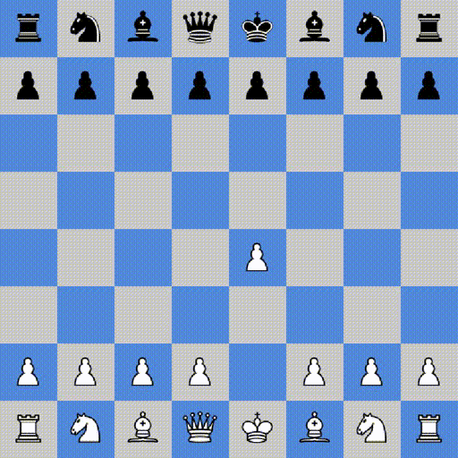

# ♚ PyChess

Full-featured Chess game written using Python.

## Screenshots

 &nbsp; &nbsp; &nbsp; 

## How to play

To set up: clone repo & run ```pip install -r requirements.txt```
To run: run ```py chess.py```.

## Features
- Chess AI which uses minimax & alpha-beta pruning to search the game tree and find the best move (current AI ELO is around ~1000)
- Player vs. Player, Player vs. AI, even AI vs. AI!
- Pinning pieces
- Checking, checkmating
- En passant
- Castling
- Pawn promotion
- Movement animation
- Draw by:
  - Stalemate
  - Insufficient material
  - 3-fold repetition
  - 50-move rule

## Command-line switches
Default playing mode is Player vs. Player. To play a different mode (vs. AI), use the following switches:
- ```--black``` to play as Black.
- ```--white``` to play as White.
- ```--ai-vs-ai``` to watch 2 AI's battle it out!

## Bonus: AI vs. itself
(**AI evaluation functions in progress**) <br /><br />

